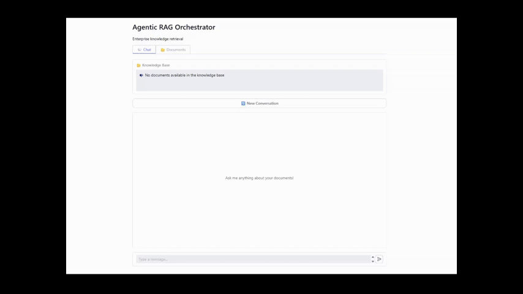

# Agentic RAG Orchestrator

> A production-grade hybrid retrieval and agent orchestration system built with LangGraph that performs contextual reasoning over enterprise knowledge bases.

Upload any PDF documents and ask questions in plain English. The system retrieves only from your documents, validates confidence, and streams answers token by token.



---

## What Makes This Different From a Basic RAG

Most RAG demos follow the same pattern: embed documents → retrieve chunks → prompt LLM → return answer. That works for demos.

This system adds the layer between POC and internal tool:

| Basic RAG | Agentic RAG Orchestrator |
|---|---|
| Single retrieval pass | Query rewriting + multi-step agentic retrieval loop |
| Returns answer regardless of confidence | Confidence scoring with low-match warnings |
| Hallucinates from adjacent content | Strict source fidelity rules + score threshold filtering |
| Shared session for all users | Per-session isolation via `gr.State` UUID |
| No caching | Two-tier per-session + cross-session cache with TTL |
| Silent errors | Structured error classification with 5 error types |
| Accepts any file | File type and size validation with per-file error messages |

---

## Features

- **Hybrid Retrieval** - Dense semantic search (all-mpnet-base-v2) + Sparse BM25 combined with Reciprocal Rank Fusion
- **Parent-Child Chunking** - Small chunks for precise retrieval, large parent chunks for full context
- **Agentic ReAct Loop** - LangGraph agent that searches, retrieves, and reasons in multiple steps
- **Query Rewriting** - Rewrites user questions into optimized search queries before retrieval
- **Clarification Handling** - Asks for clarification on ambiguous questions via LangGraph interrupt
- **Confidence Scoring** - Warns users when retrieval scores fall below threshold
- **Two-Tier Response Cache** - Per-session cache + cross-session cache with Least Recently Used (LRU) eviction and configurable TTL
- **Multi-User Session Isolation** - Each browser session gets an isolated LangGraph thread
- **True Token Streaming** - Real-time streaming via `astream_events()` not batch responses
- **Structured Error Classification** - `RETRIEVAL_EMPTY`, `LLM_TIMEOUT`, `GRAPH_ERROR`, `OFF_TOPIC`, `UNEXPECTED`
- **File Validation** - Type and size validation with configurable limits in `config.py`
- **Structured JSON Logging** - Per-request latency breakdown, retrieval scores, and error types

---

## Architecture

```
LAYER 1 - PRESENTATION
  Gradio UI (gradio_app.py)
  gr.ChatInterface + gr.State (per-session isolation)
        |
        v
LAYER 2 - SERVICE
  ChatService          DocumentManager
  ResponseCache
        |
        v
LAYER 3 - ORCHESTRATION
  RAGOrchestrator
  LangGraph State Machine:
    summarize -> analyze_rewrite -> process_question -> aggregate
        |
        v
LAYER 4 - INFRASTRUCTURE
  AppContainer
  Qdrant VectorDB   ParentStore   GPT-4o-mini   DocumentChunker
```

### LangGraph Agent Flow

```
User Query
    │
    ▼
summarize          ← condenses conversation history if > 4 messages
    │
    ▼
analyze_rewrite    ← rewrites query, detects ambiguity, requests clarification
    │
    ├── unclear ──► human_input  ← LangGraph interrupt, waits for user
    │
    ▼
process_question   ← agentic ReAct subgraph (one per rewritten question)
    │   ┌─────────────────────────┐
    │   │ agent ──► tools         │
    │   │   │     search_chunks   │
    │   │   │     retrieve_parent │
    │   │   └──► extract_answer   │
    │   └─────────────────────────┘
    ▼
aggregate          ← deduplicates, confidence checks, synthesizes final answer
    │
    ▼
Stream to UI       ← token-by-token via astream_events()
```

---

## Tech Stack

| Component | Technology |
|---|---|
| LLM | GPT-4o-mini via OpenAI API |
| Agent Framework | LangGraph |
| Vector Database | Qdrant (local) |
| Dense Embeddings | sentence-transformers/all-mpnet-base-v2 |
| Sparse Embeddings | Qdrant BM25 |
| UI Framework | Gradio 6.3.0 |
| Logging | Python structlog (JSON) |

---

## Quick Start

### Prerequisites

- Python 3.10+
- OpenAI API key
- Conda or virtualenv (recommended)

### Installation

```bash
# Clone the repository
git clone https://github.com/Vikram0811/agentic-rag-orchestrator.git
cd agentic-rag-orchestrator

# Create and activate environment
conda create -n rag_env python=3.10
conda activate rag_env

# Install dependencies
pip install -r requirements.txt
```

### Configuration

```bash
# Copy environment template and add your OpenAI API key
cp .env.example .env
```

Edit `.env`:
```
OPENAI_API_KEY=your-openai-api-key-here
```

### Run

```bash
python app.py
```

Open your browser at `http://127.0.0.1:7860`

1. Go to the **Documents** tab and upload one or more PDF files
2. Switch to the **Chat** tab and start asking questions

---

## Configuration Reference

All tunable parameters are in `config.py`:

| Parameter | Default | Description |
|---|---|---|
| `RAG_MIN_RETRIEVAL_SCORE` | `0.62` | Minimum score for a chunk to reach the LLM. Tune per document set. |
| `CONFIDENCE_THRESHOLD` | `0.4` | Top score below this triggers a low-confidence warning |
| `MAX_FILE_SIZE_MB` | `50` | Maximum upload file size in MB |
| `ALLOWED_EXTENSIONS` | `[".pdf", ".md"]` | Accepted file types |
| `CACHE_TTL_SECONDS` | `3600` | Cross-session cache expiry in seconds |
| `CACHE_MAX_CROSS_SESSION` | `500` | Maximum cross-session cache entries before Least Recently Used (LRU) eviction |
| `CHILD_CHUNK_SIZE` | `500` | Child chunk size in characters |
| `CHILD_CHUNK_OVERLAP` | `100` | Overlap between child chunks |
| `MIN_PARENT_SIZE` | `2000` | Minimum parent chunk size |
| `MAX_PARENT_SIZE` | `10000` | Maximum parent chunk size |
| `LLM_MODEL` | `gpt-4o-mini` | OpenAI model name |
| `LLM_TEMPERATURE` | `0` | LLM temperature - keep at 0 for factual RAG |

---

## Project Structure

```
agentic-rag-orchestrator/
├── app.py                  # Entry point
├── config.py               # All tunable parameters
├── document_chunker.py     # Parent-child chunking logic
├── util.py                 # PDF to Markdown conversion
├── core/
│   ├── app_container.py    # Infrastructure lifecycle owner
│   ├── chat_service.py     # UI entry point, timeout, error handling
│   ├── document_manager.py # Document ingestion and validation
│   ├── logging_config.py   # Structured JSON logging setup
│   ├── rag_orchestrator.py # LangGraph interface and streaming
│   ├── response_cache.py   # Two-tier cache implementation
│   └── schemas.py          # RAGResponse, StreamEvent, ErrorType
├── db/
│   ├── parent_store_manager.py  # JSON-based parent chunk store
│   └── vector_db_manager.py     # Qdrant collection management
├── rag_agent/
│   ├── edges.py            # LangGraph conditional edges
│   ├── graph.py            # Graph and subgraph compilation
│   ├── graph_state.py      # State and AgentState definitions
│   ├── nodes.py            # All node functions
│   ├── prompts.py          # All LLM prompts
│   ├── schemas.py          # QueryAnalysis structured output
│   └── tools.py            # search_child_chunks, retrieve_parent_chunks
└── ui/
    ├── css.py              # Custom Gradio CSS
    └── gradio_app.py       # Gradio UI definition
```

---

## Documentation

- [Workflow Walkthrough](docs/WORKFLOW.md) - step-by-step trace from user query to streamed answer
- [Component Reference](docs/COMPONENTS.md) - detailed explanation of every system component

---

## Known Limitations

- In-memory cache resets on restart - replace with Redis for persistent caching
- Qdrant runs locally - use Qdrant Cloud for multi-instance deployment
- `RAG_MIN_RETRIEVAL_SCORE` is calibrated per document set - tune for your PDFs
- No answer validation step - LLM answer not programmatically verified against source post-generation
- No rate limiting - add per-session rate limiting before production/public deployment

---

## Credits

Base architecture inspired by [Giovanni Pasqualino's RAG implementation](https://github.com/GiovanniPasq/agentic-rag-for-dummies).

Extended with production hardening across three tiers: hybrid retrieval with score threshold filtering, two-tier response caching with Least Recently Used (LRU) eviction, multi-user session isolation, structured error classification and JSON observability, confidence scoring and source fidelity enforcement, file type and size validation, and conversation reset with session-aware cache clearing.

---

## License

MIT License - see [LICENSE](LICENSE) for details.
